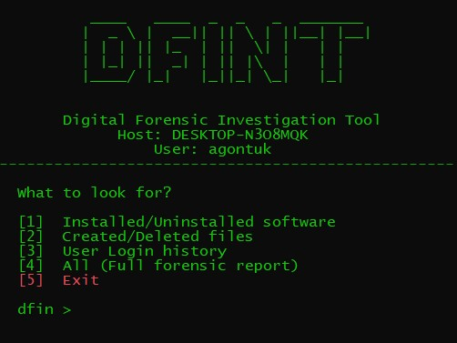

# DFINT — Digital Forensic Investigation Tool

A small PowerShell-based Windows CLI utility for basic forensic triage.

**Snapshoot:** <br>


## Features

- Installed software from Windows uninstall registry keys
- Windows Installer uninstall evidence
- Historical file creation/deletion events from the NTFS USN Change Journal
- Windows Security Event Log login/logoff history
- JSON export
- Administrator-awareness and graceful error handling

## Requirements

- Windows
- PowerShell 5.1+ or PowerShell 7+
- NTFS for USN Journal file activity
- Administrator privileges are recommended

## Installation

Clone or download the project, then open PowerShell in the DFINT directory.

## Usage

```powershell
.\DFINT.ps1
```

Then choose a collector:

```text
1. Installed/Uninstalled software
2. Created/Deleted files
3. User Login history
4. All
5. Exit
```

Enter the requested number of days.

JSON export:

By default DFINT generate a JSON file for the logs inside reports folder.

## Administrator requirement

It request for running as Administrator when running. Additionally, it warns that Security Event Log and some filesystem/USN information may be unavailable.

## USN Journal limitation

Deleted-file detection is based on records still present in the NTFS USN Change Journal. The USN Journal is a rolling journal. If the relevant records have already been overwritten, DFINT cannot recover those historical deletion events from the journal.

DFIN does not fabricate deleted files, timestamps, or paths.

## Security Event Log limitation

Login history depends on the Windows Security Event Log retaining the relevant events and permitting access to them. Some fields, such as source IP, may not exist for every event.

## Forensic note

DFINT is a triage utility, not a replacement for a full forensic acquisition or forensic suite. Results represent evidence available from the Windows artifacts queried by the tool.

## License

MIT License.
